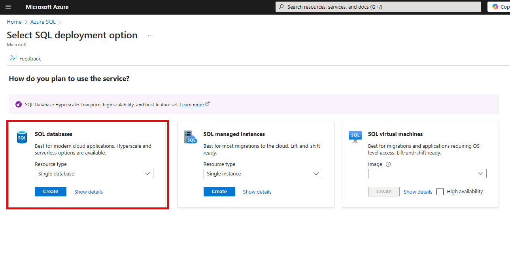

# Part 1: Start with the data

In the first part we will create a new Azure SQL database, use Entity Framework Core to create tables and implement the code to ingest our test PDF file.

## Create the database

This section walks through creating the database in Azure.

1. Login to the [Azure portal](https://portal.azure.com)
2. Type **Azure SQL** in the search box in the top center

3. Select the **Azure SQL** item
4. Click the **Create** button in the upper left corner

This will show you a few deployment options. 

5. In the left item with **SQL databases -> Single database**, click the **Create** button

We can now create the Azure SQL Database and Server

6. Select the subscription you want to use and create a new resource group named **rg-azuresql-db**

7. Give you database a unique name (I used **db-sqlazure-lab** for mine)
8. Next click the **Create new** link to create a new Azure SQL database server
9. On the Create SQL Database Server page, fill in the following:
* **Server name**
* **Location**
* **Authentication method** -> choose the **Use SQL authentication**
* **Server admin Login**
* **Password** and **confirm password**

10. Click **OK**

11. Back on the Create SQL Database page, verify the **Workload environment** is set to **Development**

If you want you can use the **Configure database** link to verify the sizes and see an estimated cost.

12. Click the **Next: Networking** button at the bottom of the page
13. On the Connectivity method, select **Public endpoint**, then turn the **switch on** for **Add current client IP address**. 

This will allow you to access the server when we verify the schema and data later.

14. Next click **Review + Create** button

I'm using the East US 2 datacenter and it shows I'll be chared <$5.00 for a month of usage

15. Click the **Create** button to finally create the database and server.

This will take a few minutes, so let's move on to the code.

## [Next: Get started with the code >](part1-2.md)