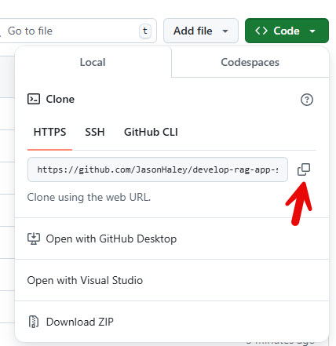

## Get the code

In this section we will get the starter code from GitHub and use Entity Framework Core to build out our data models and context.

1. If you haven't already cloned the repository, go to the GitHub repo  [develop-rag-app-sk-ef-azure-sql-db](https://github.com/JasonHaley/develop-rag-app-sk-ef-azure-sql-db), click on the **Code dropdown** button and click **copy url to clipboard** button



2. On your machine, you'll need a directory to put the code in. Open a console window and navigate to where you want to put the code. The run the following command:

```PowerShell
git clone https://github.com/JasonHaley/develop-rag-app-sk-ef-azure-sql-db.git
```

3. Once the code has downloaded run the following, in order open it in VS Code:

```PowerShell
cd develop-rag-app-sk-ef-azure-sql-db
code .
```

This will open VS Code with the directory loaded. Look for the **/src/start** folder.


## A Quick Look At What Is Provided

In order to keep this lab focused on SQL Azure, Entity Framework and Semantic Kernel, the project already provides some none related but relevant things - let's look at those first. **Feel free to skip this!**

The **assets** folder - provides a couple of PDFs you can use for the sample data

The **Configuration** folder provides some helpers.
* `CommandOptions.cs` - provides basic command logic to use the **System.CommandLine** package for handling command line arguments.
* `ConfigurationExtentions.cs` - provides configuration logic for loading appsettings.json and a couple of helpers that simplify using a ConnectionString to load LLM settings for OpenAI or AzureOpenAI.
* `Extensions/ReadOnlyMemoryExtensions.cs` - has an extension method for converting a `ReadOnlyMemory<float>` to a `float[]` which will be used when saving embeddings.
* **Models** folder has three classes we will use for the object model representing a `Document`, `Page` and `PageChunk`. More on these soon.
* **ChatBot.cs** - is a starter class which will end up containing the messaging loop when we are done.
* **PdfChatApp.csproj** - This contains the package references as you would expect, however there are a few other things I want to highlight:

The **ProperyGroup** at the top:
```XML
<PropertyGroup>
	<OutputType>Exe</OutputType>
	<TargetFramework>net8.0</TargetFramework>
	<ImplicitUsings>enable</ImplicitUsings>
	<Nullable>enable</Nullable>
	<NoWarn>SKEXP0001;SKEXP0050;SKEXP0010;SKEXP0020</NoWarn>
	<!--<StartArguments>-f assets\ATaxonomyOfRAG.pdf</StartArguments>-->
	<!--<StartArguments>-f assets\*.pdf</StartArguments>-->
	<!--<StartArguments>-f assets\semantic-kernel.pdf</StartArguments>-->
	<!--<StartArguments>-r assets\semantic-kernel.pdf</StartArguments>-->
</PropertyGroup>
```

The `<NoWarn>SKEXP0001;SKEXP0050;SKEXP0010;SKEXP0020</NoWarn>` line is the easiest way to escape the experimental notifications you'll get with Semantic Kernel (due to us using prerelease functionality).

The lines like `<!--<StartArguments>-f assets\ATaxonomyOfRAG.pdf</StartArguments>-->` will be uncommented later when running the application as an option to passing the arguments on the command line.

The bottom **ItemGroup**:
```XML
<ItemGroup>
    <None Update="appsettings.Local.json">
        <CopyToOutputDirectory>PreserveNewest</CopyToOutputDirectory>
    </None>
    <None Update="appsettings.json">
        <CopyToOutputDirectory>PreserveNewest</CopyToOutputDirectory>
    </None>
    <None Update="assets\ATaxonomyOfRAG.pdf">
        <CopyToOutputDirectory>PreserveNewest</CopyToOutputDirectory>
    </None>
    <None Update="assets\semantic-kernel.pdf">
        <CopyToOutputDirectory>Always</CopyToOutputDirectory>
    </None>
</ItemGroup>
```

You probably know what these are, but in case you don't - this is the information that lets .NET know it needs to copy the sample pdf files and the appsettings files when it compiles. Otherwise the files won't be found at runtime.

* `Program.cs` is the starting point with // TODO: items for placeholders.

The application is a console application that will run as a chat bot - if you don't pass any arguments on the command line. Optionally, argument options are used to process files:

| Argument       | Purpose        |
|----------------|----------------|
| -f | Takes the path to the PDF files (or directory) to injest into the database |
| -r | Takes a path to the PDF to remove from the database |
| -ra | Removes all files form the database |

> NOTE: if you just run PdfChatApp.exe with **no arguments** it will behave as a chat bot

## Setup the Database

By now the Azure SQL database should be created, let's configure the code to use it.

1. In the PdfChatApp folder, create a new file named **appsettings.Local.json** and paste the following in it and save:

```JSON  
{
  "ConnectionStrings": {
    "SqlAzureDB": "Server=[your server name].database.windows.net;Database=[your db name];User Id=[user name];Password=[password];Persist Security Info=True;MultipleActiveResultSets=True;TrustServerCertificate=True;"
  }
}
```

2. Relace the following with the values you used creating your database:
 * **[your server name]** - with the name of your Azure SQL database server
 * **[your db name]** - with the name of the database
 * **[user name]** - the Server admin login you used
 * **[password]** - the password you used

3. In the **Program.cs** file, replace line 7 with the following:

```C#
builder.Services.AddDbContext<DocDbContext>(options => 
    options.UseSqlServer(builder.Configuration.GetConnectionString("SqlAzureDB"), o => o.UseVectorSearch()));
```

This adds the **DocDbConext** (which we will create next), to the dependency injection system, sets the connection string to what we just created in the **appsettings.Local.json**, as well as adds the `UseVectorSearch()` EF Core plugin. This is provided by the referenced package: `EFCore.SqlServer.VectorSearch`.

3. Add the following using statements to the top of the **Program.cs** file:

```C#
using Microsoft.EntityFrameworkCore;
using Microsoft.Extensions.DependencyInjection;
using Microsoft.Extensions.Configuration;
using PdfChatApp.Models;
```

## Create the DbContext

We jumped ahead with the last step by adding a DbContext class that doesn't exist yet. Let's create it now.

1. In the **Models** folder create a new file named **DocDbContext.cs** and add the following:

```C#
using Microsoft.EntityFrameworkCore;

namespace PdfChatApp.Models;
public class DocDbContext(DbContextOptions<DocDbContext> options) : DbContext(options)
{
    public DbSet<Document> Documents { get; set; }
    public DbSet<Page> Pages { get; set; }
    public DbSet<PageChunk> PageChunks { get; set; }

    protected override void OnModelCreating(ModelBuilder modelBuilder)
    {
        modelBuilder.Entity<Document>(entity =>
        {
            entity.HasKey(e => e.Id).HasName("PK_Document_ID");
            entity.ToTable("Document");

            entity.HasMany(p => p.Pages).WithOne().HasForeignKey(p => p.Id).OnDelete(DeleteBehavior.Cascade);
        });

        modelBuilder.Entity<Page>(entity =>
        {
            entity.HasKey(e => e.Id).HasName("PK_Page_ID");
            entity.ToTable("Page");

            entity.HasOne(p => p.Document).WithMany(p => p.Pages).HasForeignKey(p => p.DocumentId);
            entity.HasMany(p => p.PageChunks).WithOne(p => p.Page).HasForeignKey(p => p.PageId).OnDelete(DeleteBehavior.Cascade);
        });

        modelBuilder.Entity<PageChunk>(entity =>
        {
            entity.Property(p => p.Embedding).HasColumnType("vector(384)"); // NOTE: array dimensions need to match the embedding dimensions
            
            entity.HasKey(e => e.Id).HasName("PK_PageChunk_ID");
            entity.ToTable("PageChunk");

            entity.HasOne(p => p.Page).WithMany(p => p.PageChunks).HasForeignKey(p => p.PageId);
        });
    }
}
```

This is going to be our DbContext for interacting with the database. You can there will be three tables:

* Documents
* Pages
* PageChunks

I'm assuming you are already familiar with the majority of the `OnModelCreating()` method, however notice line 31:

```C#
entity.Property(p => p.Embedding).HasColumnType("vector(384)"); // NOTE: array dimensions need to match the embedding dimensions
```

The `.HasColumnType("vector(384)")` is required to create a column in Azure SQL that will be a VECTOR with 384 dimensions. 

> NOTE: If you plan on modifying this code to use an OpenAI Ada 2 embedding, you will need to modify this to be `.HasColumnType("vector(1536)");` to allow for a bigger vector.

2. In the folder view, right click on the PdfChatApp directory and select **Open in Integrated Terminal**


3. Verify it will build by running:

```PowerShell
dotnet build
```

You should get some warnings, but it should build.

4. Create the migrations and update the database by running the following two commands:

```PowerShell
dotnet ef migrations add InitialCreate
dotnet ef database update
```

Now let's connect using Sql Server Management Studio and see if the tables were created.

5. Open Sql Server Management Studio and connect to your Azure SQL database


6. Expand the Tables and the PageChunk table to verify it has a **VECTOR** type


Now we have the database configured and tables created, next we need to write the code to parse a PDF and save it into the database.

## [Next: Write the PDF Parsing and Saving Code >](part1-3.md)