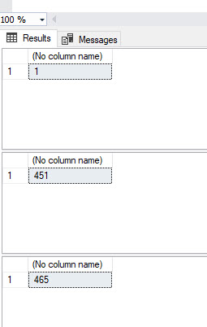
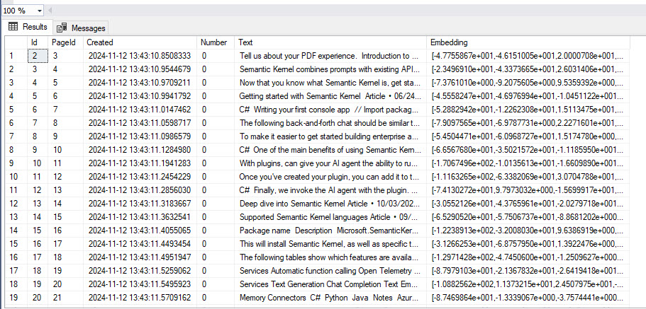

## Save the PDF and Embeddings to the Azure SQL Database

In this section we will create logic to save to the database tables we just created, some utility code to parse a PDF file using **PdfPig**, use a local embeddings model to generate text embedding for parts of the PDF file and then save all that to the database. By the end of this section, we will be able to run the application to parse, embed and save a PDF file.

Often times when using EF Core you will use a repository pattern class to wrap all the database logic. We will be doing something similar, I am just calling it **DocumentService**.

1. In the **PdfChatApp** project folder, create a new folder named **Services** and add a file named **DocumentService.cs** to it.

2. Add the following contents to the **DocumentService.cs** file you just created and save it:

```C#
using Microsoft.EntityFrameworkCore;
using PdfChatApp.Models;

namespace PdfChatApp.Services;
public class DocumentService(DocDbContext dbContext)
{
    public async Task<List<Document>?> GetDocumentsAsync()
    {
        return await dbContext.Documents.ToListAsync();
    }

    public async Task<Document?> GetDocumentAsync(int id)
    {
        return await dbContext.Documents.FindAsync(id);
    }

    public async Task<bool> DocumentExistsAsync(string name)
    {
        return await dbContext.Documents.AnyAsync(d => d.Name == name);
    }

    public async Task<Document?> AddDocumentAsync(Document document)
    {
        dbContext.Documents.Add(document);
        await dbContext.SaveChangesAsync();
        return document;
    }

    public async Task RemoveDocumentAsync(string name)
    {
        var document = await dbContext.Documents.FirstOrDefaultAsync(d => d.Name == name);
        if (document != null)
        {
            dbContext.Documents.Remove(document);
            await dbContext.SaveChangesAsync();
        }
    }

    public async Task RemoveAllDocumentsAsync()
    {
        dbContext.Documents.RemoveRange(dbContext.Documents);
        await dbContext.SaveChangesAsync();
    }
}
```

As you can see with the above logic, it is just normal EF Core logic - nothing special here. Now we have the logic to do everything except parse and split the PDF file. That is next.

## Parsing, Embedding and Saving the PDF in Azure SQL

We are going to use a package named **PdfPig** to read the PDF file and return the pages and text for us. Since we are going to be creating embeddings for this file we need to break the pieces up into chunks of text so those pieces are not too large. Sometimes this process is called **ingesting data**. Let's create a PdfIngestor.

1. In the **PdfChatApp** project folder, create a new folder named **Ingestors** and add a file named **PdfIngestor.cs** to it.

First lets add the utility methods that aren't all that exiting. 

2. Add the following to the **PdfIngestor.cs** file you just created:

```C#
using Microsoft.Extensions.FileSystemGlobbing;
using Microsoft.Extensions.FileSystemGlobbing.Abstractions;
using Microsoft.ML.Tokenizers;
using Microsoft.SemanticKernel.Text;
using PdfChatApp.Extensions;
using PdfChatApp.Services;
using SmartComponents.LocalEmbeddings.SemanticKernel;
using UglyToad.PdfPig;
using UglyToad.PdfPig.Content;
using UglyToad.PdfPig.DocumentLayoutAnalysis.PageSegmenter;
using UglyToad.PdfPig.DocumentLayoutAnalysis.WordExtractor;
using Db = PdfChatApp.Models;

namespace PdfChatApp.Ingestors;

public class PdfIngestor(DocumentService documentService)
{
    public async Task RunAsync(string filesPath)
    {
        string[] files = GetFileNames(filesPath);

        Console.WriteLine($"Processing {files.Length} files...");

        var tasks = Enumerable.Range(0, files.Length)
           .Select(i =>
           {
               var fileName = files[i];
               return ProcessSingleFileAsync(fileName);
           });

        await Task.WhenAll(tasks);
    }

    private static string[] GetFileNames(string filesPath)
    {
        Matcher matcher = new();
        matcher.AddInclude(filesPath);

        var results = matcher.Execute(
            new DirectoryInfoWrapper(
                new DirectoryInfo(Directory.GetCurrentDirectory())));

        var files = results.HasMatches
            ? results.Files.Select(f => f.Path).ToArray()
            : [];
        return files;
    }

    // TODO: Add ProcessSingleFileAsync() for parsing and embedding logic
    
    private static string GetPageText(Page pdfPage)
    {
        var letters = pdfPage.Letters;
        var words = NearestNeighbourWordExtractor.Instance.GetWords(letters);
        var textBlocks = DocstrumBoundingBoxes.Instance.GetBlocks(words);
        return string.Join(Environment.NewLine + Environment.NewLine,
            textBlocks.Select(t => t.Text.ReplaceLineEndings(" ")));
    }
}
```

This file has a lot of using statements at the top (required for what is coming next), the entry method `RunAsync()` which starts off with getting the list of PDF files we are going to process. We also have a `GetPageText()` that grabs the text out of a PDF page for us.

Let's build the rest of this class step by step.

3. Paste the following on line 49, replacing the // TODO: 

```C#
        public async Task ProcessSingleFileAsync(string file)
        {
            var docName = Path.GetFileNameWithoutExtension(file);

            if (await documentService.DocumentExistsAsync(docName))
            {
                Console.WriteLine($"Document {docName} already exists.");
                return;
            }
    
            // TODO: Text chunking and embedding
        }
```

This opening of the `ProcessSingleFileAsync()` does a little housekeeping by grabbing the name of the file and checking the database if it already exists. When it does, it just exists in order to keep from processing duplicates.

4. Now add the following on line 59, replacing the // TODO: Text chunking and embedding

```C#
        Console.WriteLine($"Generating chunks for {file}...");
        var document = new Db.Document
        {
            Name = docName,
            Path = file
        };

        using var localEmbeddingGenerator = new LocalTextEmbeddingGenerationService();

        var chunkCount = 0;
        var tokenizer = TiktokenTokenizer.CreateForModel("gpt-4o");
        
        // TODO: Parse and save the document
```

This writes out the file name we are getting ready to process and initializes a new Document model for use to populate.

We also are using `LocalTextEmbeddingGenerationService` from the `SmartComponents.LocalEmbeddings.SemanticKernel` nuget package in order to create embeddings on our machine (instead of using OpenAI). 

In order to create a chunk of text based on a token size we next create a tokenizer using TiktokenTokenizer and initialize it for "gpt-4o". Remember models use different tokenizers - so this means when we create our LLM deployment later we need to use gpt-4o for the best results.

5. Now paste the following on line 71 replacing the // TODO: Parse and save the document

```C#
        using var pdf = PdfDocument.Open(file);
        foreach (var page in pdf.GetPages())
        {
            var dbPage = new Db.Page
            {
                Number = page.Number,
            };

            var pageText = GetPageText(page);
            var paragraphs = TextChunker.SplitPlainTextParagraphs([pageText], 500, 100, null, text => tokenizer.CountTokens(text));

            for (int i = 0; i < paragraphs.Count; i++)
            {
                var paragraph = paragraphs[i];
    
                var pageChunk = new Db.PageChunk
                {
                    Text = paragraph,
                    Number = i,
                    Embedding = (await localEmbeddingGenerator.GenerateEmbeddingsAsync([paragraph])).ToFloatArray()
                };

                chunkCount++;

                dbPage.PageChunks.Add(pageChunk);
            }
            document.Pages.Add(dbPage);
        }
        
        await documentService.AddDocumentAsync(document);

        if (chunkCount > 0)
        {
            Console.WriteLine($"Generated {chunkCount} chunks.");
        }

```

This code opens a PDF file and loops through all of its pages. Inside of each loop, we create a Page model to add to the Document model at the end of the loop.

Once we get the page text, we use `var paragraphs = TextChunker.SplitPlainTextParagraphs([pageText], 500, 100, null, text => tokenizer.CountTokens(text));` to split it into paragraphs, using a max of 500 tokens and an overlap of 100 tokens.

Then we loop through those paragraphs, create PageChunk models and populate with the Text, number of the chunk, Embedding for the paragraph and add that PageChunk to the Pages. Once all paragraphs on a page are added, then the Page is added to the Document.

Once all the pages have been processed, the Document is saved to the database.

When all is done, it writes out the number of chunks that were generated.

Next we need to wire up the command line arguments in **Program.cs** file so we can test this code.

## Test the PDF Ingestor logic

1. In **Program.cs** replace the // TODO: statements on lines 15 and 16 with the following:

```C#
builder.Services.AddScoped<DocumentService>();
builder.Services.AddScoped<PdfIngestor>();
```

This will add the **DocumentService** and **PdfInjestor** to the ServiceCollection to use later.

2. On line 32, replace the // TODO: statement with the following:

```C#
            var documentService = services.GetRequiredService<DocumentService>();
            var docName = Path.GetFileNameWithoutExtension(options.Remove);
            await documentService.RemoveDocumentAsync(docName);
```

This logic will read the arguments from the command line and pass them to the DocumentService to remove the document from the database.

3. On line 38, replace the // TODO: statement with the following:

```C#
            var pdfIngestor = services.GetRequiredService<PdfIngestor>();
            await pdfIngestor.RunAsync(options.Files);
```

This logic passes the file name from the command line to the PdfIngestor.

4. For completeness, on line 43 replace the // TODO statement with the following:

```C#
            var documentService = services.GetRequiredService<DocumentService>();
            await documentService.RemoveAllDocumentsAsync();
```

This adds the call to remove all files if the -ra argument was passed.

5. Add the needed using statements to the top of the **Program.cs** file:

```C#
using PdfChatApp.Ingestors;
using PdfChatApp.Services;
```

6. In the **PdfChatApp.csproj** file, uncomment line 11 so it looks like this:

```XML
<StartArguments>-f assets\semantic-kernel.pdf</StartArguments>
```

7. In the terminal window, run the application

```PowerShell
dotnet run
```

The output should look something like this:
```PowerShell
Processing 1 files...
Generating chunks for assets/semantic-kernel.pdf...
Generated 465 chunks.
```

8. Now go to SSMS and run the following SQL statements

```SQL
select count(1) from document
select count(1) from [page]
select count(1) from pagechunk
```

The output should look like this:



If you look at the content of the PageChunk table, you'll see something like this:



We now can parse, embed and save a PDF file to the database.

## [Next:  >](part2-1.md)