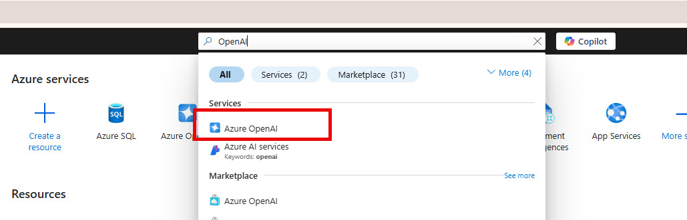
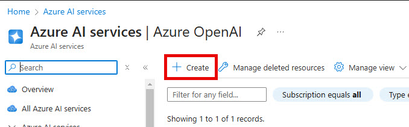
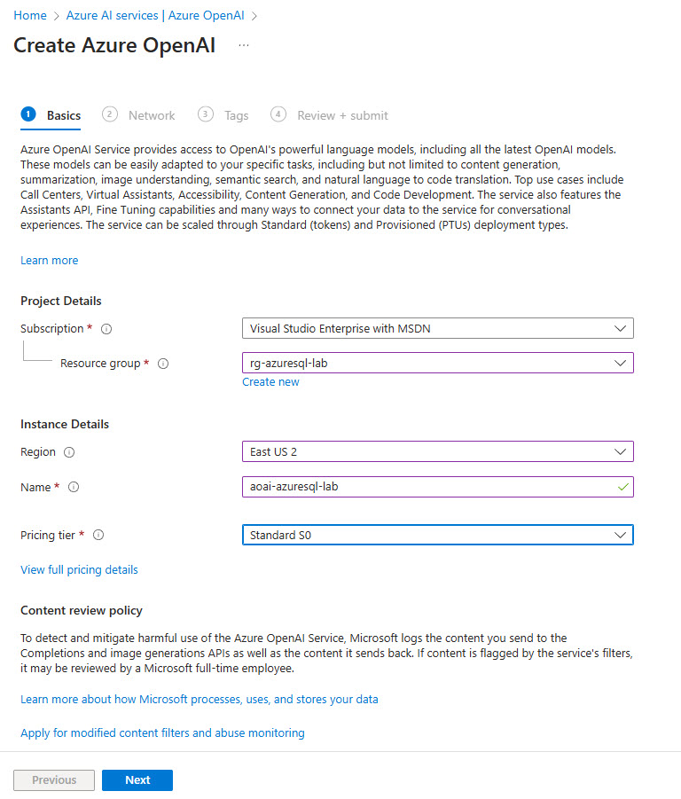
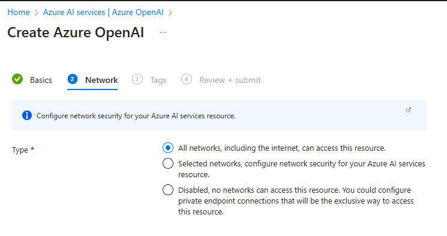
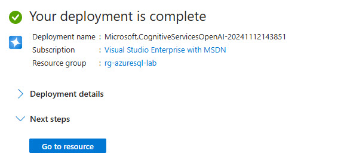
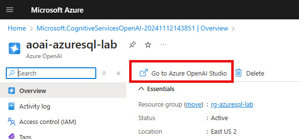
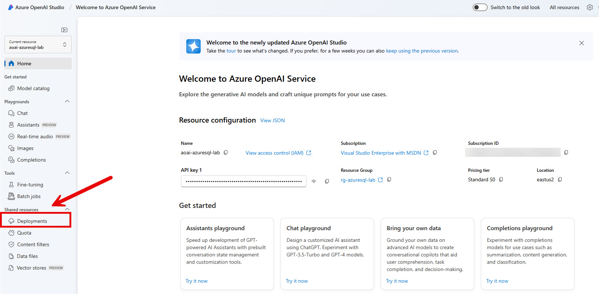
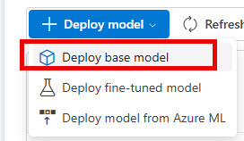
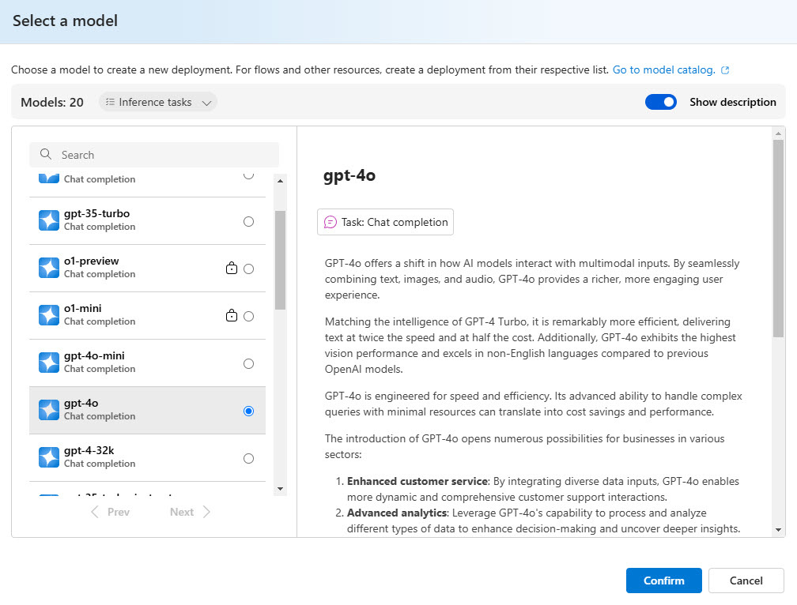
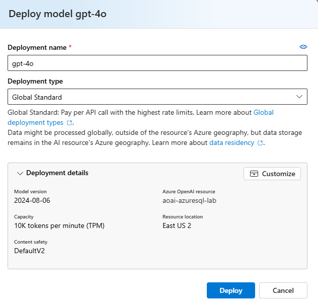

# Part 2: Create the Retriever, Add Semantic Kernel and Plugins

In the second part we will create the RAG application. Fist let's work on the retrieval.

## Create the DbRetriever

This section we will implement code using Entity Framework Core to perform a similarity search using the embeddings we populated in the last section.

1. In the **PdfChatApp** project folder, create a new folder named **Retrievers** and add a file named **DbRetriever.cs** to it.

This will hold the logic to do a similarity search in the database.

2. Paste the following code into the **DbRetriever.cs** file you just created:

```C#
using Microsoft.EntityFrameworkCore;
using PdfChatApp.Extensions;
using PdfChatApp.Models;
using SmartComponents.LocalEmbeddings.SemanticKernel;

namespace PdfChatApp.Retrievers;

public record DocumentInfo(int Id, int PageId, int ChunkId, string Name, string Path, string Text, double Similarity);

public class DbRetriever(DocDbContext dbContext)
{
    public async Task<List<DocumentInfo>> RetrieveLocalAsync(string text, int k)
    {
        using var localEmbeddingGenerator = new LocalTextEmbeddingGenerationService();

        var vector = (await localEmbeddingGenerator.GenerateEmbeddingsAsync([text])).ToFloatArray();

        return await dbContext.PageChunks
            .Include(pc => pc.Page).ThenInclude(p => p!.Document)
            .OrderBy(pc => EF.Functions.VectorDistance("cosine", pc.Embedding ?? new float[0], vector))
            .Take(k)
            .Select(pc => new DocumentInfo(pc!.Page!.Document!.Id, pc.PageId, pc.Id, pc.Page.Document.Name, pc.Page.Document.Path, pc.Text, EF.Functions.VectorDistance("cosine", pc.Embedding ?? new float[0], vector)))
            .ToListAsync();
    }
}
```

In the code, we first declare a `DocumentInfo` record to use in returning the information about the page chunk, document, text and similarity score.

The `DbRetriever` class has one method `RetrieveLocalAsync()` which uses the `LocalTextEmbeddingGenerationService` to get the embeddings for the passed in text, then uses the EF Core plugin mentioned earlier to use the `EF.Functions.VectorDistance()` to order the search results by their similarity score and returns the top k number of items.

Now we need to add Azure OpenAI and Semantic Kernel.

## Create an Azure OpenAI Resource and a Deployment 

In this section you will create an Azure OpenAI resource and deployment for using in the next section.

1. In the Azure Portal, type **OpenAI** in the search box in the top center



2. Select **Azure OpenAI** in the list.
3. Click the **Create** button in the upper left.



4. Fill out the following items:

* **Subscription** - select the subscription you want to use
* **Resource Group** - select the resource group you used with the Azure SQL resource
* **Region** - select the region you chose for the Azure SQL resource
* **Name** - provide a unique name for your Azure OpenAI resource
* **Pricing tier** - select the Standard S0 pricing tier



5. Click the **Next** button
6. On the Network tab, click **Next**



7. On the Tags tab, click **Next**
8. Click **Create**

This will create the Azure OpenAI resource. Next we need to create a gpt4o deployment.

### Create a GPT4o deployment

1. Once your **Azure OpenAI** resource is created, click on the **Go to resource** button



2. In the upper left corner, click the **Go to Azure OpenAI Studio** button



This will open the Azure OpenAI Studio in a new tab. You may need to authenticate again.

3. Click the **Deployments** menu item on the lower left



4. Click the **Deploy Model** dropdown button and the **Deploy base model** option



5. On the **Select a model** dialog, find **gpt-4o** in the listing and select it.



6. Select the **Confirm** button on the dialog.
7. On the Deploy model dialog, click the **Deploy** button



This could take a few minutes, so while that is creating, lets start adding Semantic Kernel to the application.

## [Next: Add Semantic Kernel >](part2-2.md)