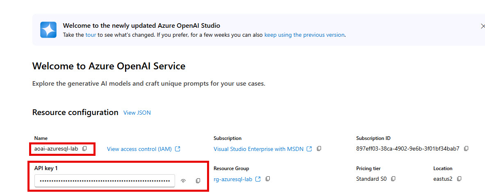

## Setup Semantic Kernel

In this section we will configure Semantic Kernel and create a couple of plugins to use the **DbRetriever** we built earlier.

1. In **Program.cs** replace the // TODO: statements on lines 19 and 20 with the following lines of code:

```C#
builder.Services.AddKernel().AddChatCompletionService(builder.Configuration.GetConnectionString("OpenAI"));
builder.Services.AddScoped<DbRetriever>();
```

This adds Semantic Kernel to the dependency injection system and adds an Azure OpenAI configured chat completion service. The **DbRetriever** we created also gets added to the DI container.

2. Open the **appsettings.Local.json** file and paste this additional connection string in the file (make sure to add a comma after the database connection string):

```JSON
, "OpenAI": "Source=AzureOpenAI;Key=[api key];ChatDeploymentName=gpt-4o;Endpoint=https://[resouce name].openai.azure.com/"
```

> NOTE: If you want to use OpenAI instead of Azure OpenAI, you will need to use a connection string like this:  
>
> ,"OpenAI": "Source=OpenAI;ChatModelId=gpt-4o-2024-08-06;ApiKey=[open ai api key]"

At this point, your Azure OpenAI resource should be created.

3. Go back to the **Azure Portal** and find your **Azure OpenAI** resource in the **Azure OpenAI Studio** tab

4. Click the Home menu item to see the configuration information. You will need the highlighted items from that page:



5. Use the **Copy API Key** button beside the API Key 1 input box to copy it to your clipboard.

6. Back in VS Code, in the **appsettings.Local.json** file replace the following:

* **[api key]** - with the contents of your clipboard
* **[resource name]** - with the name of the resource shown in the OpenAI studio

Next we will create a couple of plugins that will help Semantic Kernel perform the retrieval for us.

## Create a Plugin to Perform Retrieval

1. In the **PdfChatApp** project folder, create a new folder named **Plugins** and add a file named **DbRetrieverPlugin.cs** to it.

2. Paste the following in the **DbRetrieverPlugin** you just created:

```C#
using Microsoft.SemanticKernel;
using PdfChatApp.Retrievers;
using System.ComponentModel;
using System.ComponentModel.DataAnnotations;
using System.Text.Json;

namespace PdfChatApp.Plugins;

public class DbRetrieverPlugin(DbRetriever retriever)
{
    [KernelFunction, Description("Searches the internal documentation.")]
    public async Task<string> RetrieveAsync([Description("User's message"), Required] string question, Kernel kernel)
    {
        var searchResults = await retriever.RetrieveLocalAsync(question, 5);

        // Only here for demonstration purposes
        var resultsAsJson = JsonSerializer.Serialize(searchResults, new JsonSerializerOptions { WriteIndented = true });
        Console.WriteLine("\n\n---------------------------------------");
        Console.WriteLine("Search string: " + question);
        Console.WriteLine(resultsAsJson);
        Console.WriteLine("---------------------------------------\n\n");
        //////////////////////////////////////////

        var rag = kernel.Plugins["Prompts"];

        var llmResult = await kernel.InvokeAsync(rag["BasicRAG"],
            new() {
                { "question", question },
                { "context", JsonSerializer.Serialize(searchResults) }
            }
        );

        return llmResult.ToString();
    }
}
```

The is a **Native Function** that Semantic Kernel will use. The `RetrieveAsyn()` method uses the DbRetriever we created earlier to perform a similarity search in Azure SQL. We are currently limiting it to return the top 5 results.

I also have left in the debugging code so you can see the search results when the application is running. Feel free to remove that code.

Next we use a **Semantic Function**, which we need to create now.

3. In the **PdfChatApp** project folder, create a new folder named **Prompts**. In that folder, create a new folder named **BasicRAG**.

4. In the **BasicRAG** folder you just created, create two files:

* config.json
* skprompt.txt

5. Open the **config.json** file and paste the following:

```JSON
{
  "schema": 1,
  "description": "Basic retrieval agumented generation prompt",
  "execution_settings": {
    "default": {
      "max_tokens": 1000,
      "temperature": 0.2,
      "top_p": 0.2
    }
  },
  "input_variables": [
    {
      "name": "question",
      "description": "User's question",
      "required": true
    },
    {
      "name": "context",
      "description": "Data provided to the LLM to answer the user's question",
      "required": true
    }
  ]
}
```

This file contains the configuration information that will be used in a call to the LLM as well as the definition and description of the input parameters to expect in the template.

6. Open the **skprompt.txt** file and paste the following:

```TEXT
<message role="system">
You are a friendly assitant that helps users find answers to their questions.
Be brief in your answers.

Answer ONLY with the facts listed in the list of given to you. 
If there isn't enough information below, say you don't know. 
Do not generate answers that don't use the included sources.
</message>
<message role="user">
# Sources:
{{$context}}

# Question
{{$question}}
</message>
```

This file contains a prompt template that will be rendered when it is used and passed the arguments in **DbRetrieverPlugin** we created above. This is the prompt that is being augmented from the retrieval for the RAG pattern.

## Implement the ChatBot

In this section we will implement the ChatBot and connect it to the Program.cs file so the logic will be called when the application runs.

1. In the **ChatBot.cs** file, replace the text with the following code:

```C#
using Microsoft.SemanticKernel.ChatCompletion;
using Microsoft.SemanticKernel.Connectors.OpenAI;
using Microsoft.SemanticKernel;
using System.Text;
using PdfChatApp.Plugins;

namespace PdfChatApp;
public class ChatBot(Kernel kernel, IChatCompletionService chatCompletionService)
{
    public async Task StartAsync()
    {
        kernel.ImportPluginFromPromptDirectory("Prompts");
        kernel.ImportPluginFromType<DbRetrieverPlugin>();

        OpenAIPromptExecutionSettings openAIPromptExecutionSettings = new()
        {
            ToolCallBehavior = ToolCallBehavior.AutoInvokeKernelFunctions,
            Temperature = 0.2f,
            MaxTokens = 1000
        };

        var responseTokens = new StringBuilder();
        ChatHistory chatHistory = new ChatHistory("You are a chatbot that can answer questions about the internal documentation."); // Could add "Be brief with your responses."
        while (true)
        {
            Console.Write("\nUser: ");

            var question = Console.ReadLine();
            if (string.IsNullOrWhiteSpace(question))
            {
                break;
            }
            chatHistory.AddUserMessage(question);
            responseTokens.Clear();
            await foreach (var token in chatCompletionService.GetStreamingChatMessageContentsAsync(chatHistory, openAIPromptExecutionSettings, kernel))
            {
                Console.Write(token);
                responseTokens.Append(token);
            }

            chatHistory.AddAssistantMessage(responseTokens.ToString());
            Console.WriteLine();
        }
    }
}
```

This code takes in a Kernel and IChatCompletionService for interacting with OpenAI and the plugins we've created.

The `kernel.ImportPluginFromPromptDirectory("Prompts");` line imports the semantic function we created to call the LLM with the augmented prompt.

The `kernel.ImportPluginFromType<DbRetrieverPlugin>();` imports the **DbRetrieverPlugin** so it is available for the LLLM to call.

The following code block enables the AutoInvokeKernelFunctions so the LLM can make function calls for us as well as turns the temperature down to be less creative and provides a 1000 tokens for the maximum size:

```C#
        OpenAIPromptExecutionSettings openAIPromptExecutionSettings = new()
        {
            ToolCallBehavior = ToolCallBehavior.AutoInvokeKernelFunctions,
            Temperature = 0.2f,
            MaxTokens = 1000
        };
```

Next we use `ChatHistory` to keep track of the conversation - this is a sort of short term memory for the chatbot. In the creation of the ChatHistory we set the initial System prompt top help provide a persona `"You are a chatbot that can answer questions about the internal documentation."`

The while loop takes the user's input, passes it to the `chatCompletionService.GetStreamingChatMessageContentsAsync()` and writes out the responses as they stream back.

Now we need to connect the **ChatBot** to the **Program.cs** file

## Last item, call the ChatBot

1. In Program.cs, replace lines 49 and 50 with the following code:

```C#
            var chatCompletionService = services.GetRequiredService<IChatCompletionService>();
            var kernel = services.GetRequiredService<Kernel>();
            var chatBot = new ChatBot(kernel, chatCompletionService);
            await chatBot.StartAsync();
```

This code retrieves the dependencies the **ChatBot** needs from the DI container, creates the ChatBot and starts it.

2. Now add the following using statements to the top of the **Program.cs** file:

```C#
using Microsoft.SemanticKernel.ChatCompletion;
using Microsoft.SemanticKernel;
using PdfChatApp;
using PdfChatApp.Retrievers;
```

3. Open the **PdfChatApp.csproj**, comment out the `<StartArguments>-f assets\semantic-kernel.pdf</StartArguments>` line we uncommented earlier.

4. Add the following in the bottom ItemGroup:

```XML
        <None Update="Prompts\BasicRAG\config.json">
        	<CopyToOutputDirectory>PreserveNewest</CopyToOutputDirectory>
        </None>
        <None Update="Prompts\BasicRAG\skprompt.txt">
        	<CopyToOutputDirectory>PreserveNewest</CopyToOutputDirectory>
        </None>
```
Like with the sample PDF files and the appsettings.json files, we need to have them copied over when the project builds.

4. Build the application to verify there weren't any syntax errors:

```PowerShell
dotnet build
```

If it successfully builds, you are now ready to test it fully.

## [Next: Chat with the test PDF >](part2-3.md)